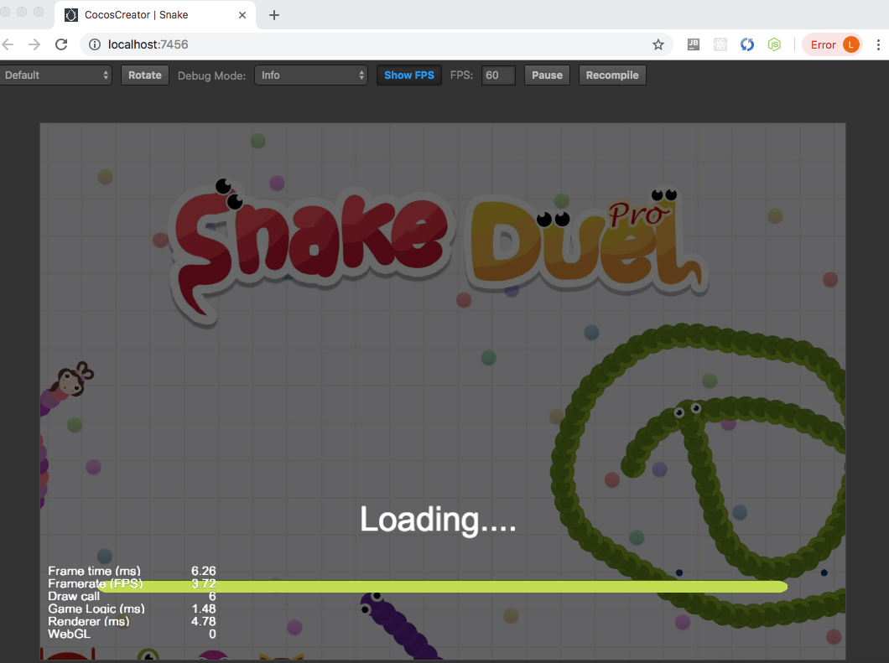
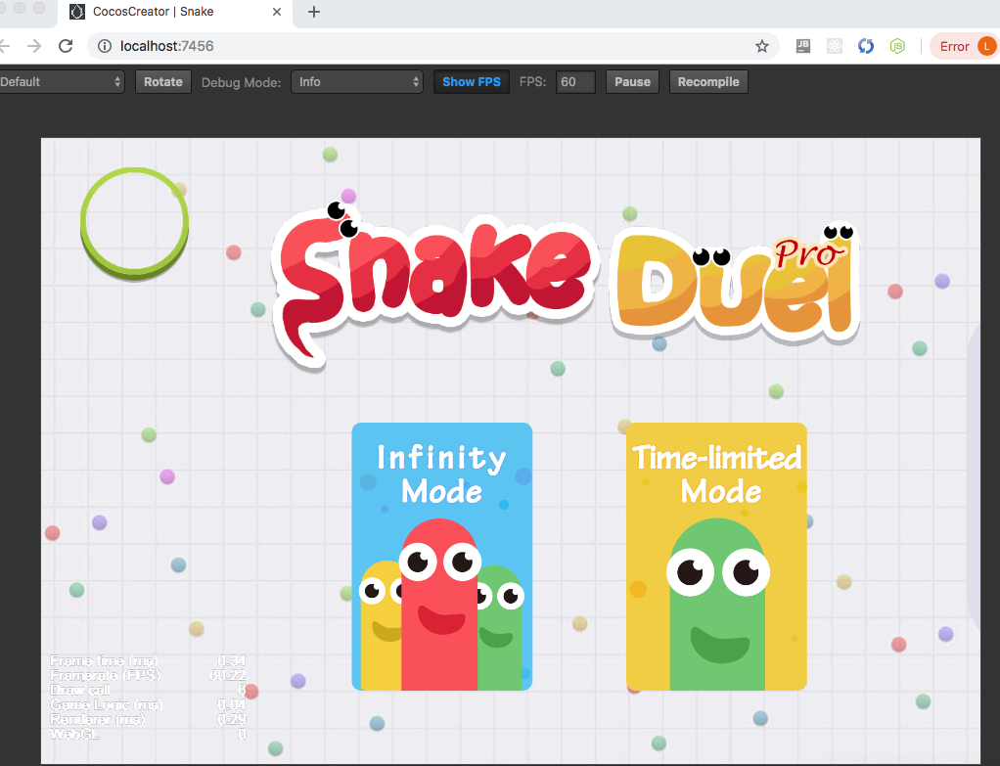
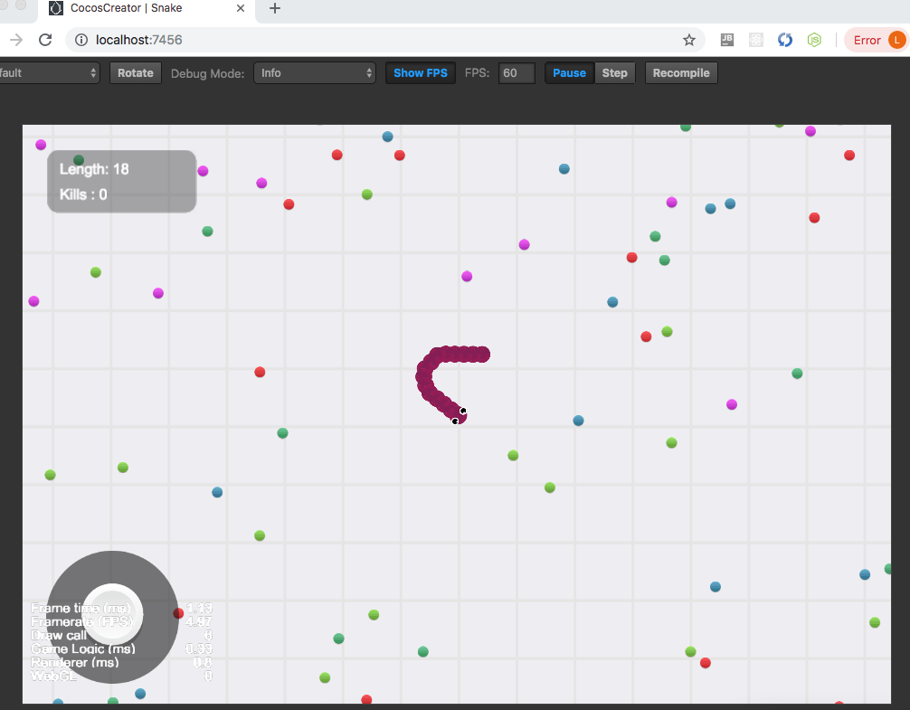

Simple Snake
======
> Cocos2d-x Game; Simple snake game that clones [Snake Duel](https://www.facebook.com/instantgames/1653342044714090), multiplayer enabled

## Overview




### Main Features
- Multiplayer Snake Game  
 
## Techniques 
- Cocos2d js  
- DevTool: [Cocos Creator](https://cocos2d-x.org/creator) v2.0.1

### 1. UI Implementation  
All UI assets are extracted from Facebook Instant Game - [Snake Duel](https://www.facebook.com/instantgames/1653342044714090)  
  
### 2. Function Implementation
#### 2.1 Snake body
*assets/scripts/Snake.js*

- Each joint of the body is a class object  
- Connect the objects as a linked list to maintain a whole snake  
  - prev, next  
- Save movement path as array of ``cc.Vec2``
  
```js
cc.Class({
    extends: cc.Component,

    properties: {
	    paths: [],
	    ...
    }
    
    ...
});    
```  
- Update position and angle of each joint in ``update(dt)``

#### 2.2 Joysticks
*assets/scripts/Joystick.js*

- Listens ``cc.Node.EventType.TOUCH_MOVE`` event and update  direction as normalized vector

#### 2.3 Food
*assets/scripts/Food.js*  
Generated in postions received from server


### 3. Third-Party Libraries
#### [Matchvs](https://doc.matchvs.com/QuickStart/QuickStart-CocosCreator) Plugin  
Implemented game server using Matchvs SDK.  
Its source code is [here](https://github.com/highjump0615/SnakeMuliplayerBackend).  

- Not added to github, due to file size  
  - *packages/plugin-matchvs/matchvs/matchvsnative/lib*


## Need to Improve
Complete and Update features